# 采购系统

#### 介绍
🔥🔥🔥本项目完全开源，采用的技术是SpringBoot+Vue+Mysql+Mybatis，项目非常的nice，带详细的部署教程,系统包括前后端、移动端，用户可以在移动端或者Web端进行下单。可以用于学习或者二次开发，感谢提出宝贵的建议，技术交流微：fly996868

开发一个采购系统需要实现多种功能，通常需要以下功能：

自动化采购流程：采购系统应能够自动执行从供应商寻源到报价比较、合同签订再到订单下达的整个采购流程，优化人工操作并降低错误率。

供应商智能管理：系统需对供应商进行综合管理，包括维护基本信息、评估及评价绩效，以完善供应商数据库并降低采购风险。

价格智能比较：通过自动比较不同供应商的报价和分析价格波动趋势，帮助企业做出更明智的采购决策，提高采购效率。

预测与决策支持：利用大数据分析技术，预测市场行情，为企业制定采购计划提供支持，同时根据历史数据和企业需求提供智能决策建议。

采购计划管理：帮助企业根据销售预测或生产计划制定详细的采购计划，包括确定产品品种和数量等。

采购订单管理：管理采购订单的创建、审批和执行，确保订单信息准确无误，并与供应商的合同条款一致。

库存管理：跟踪和管理库存水平，确保采购量与企业实际需求相匹配，避免过度库存或缺货情况的发生。

数据分析与报告：收集和分析采购数据，生成报告，为企业管理层提供关键洞察，帮助优化采购策略和流程。

#### 💥软件架构

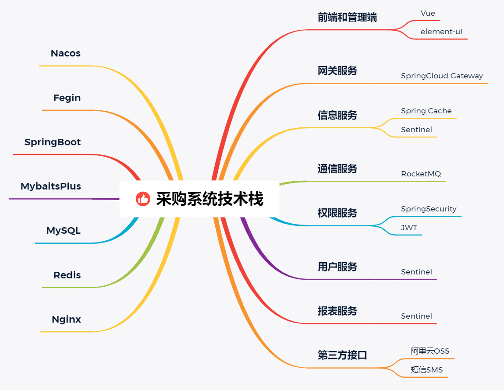

#### 💝系统演示

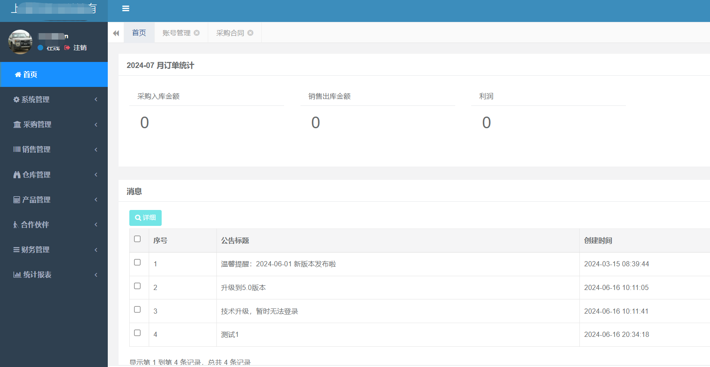
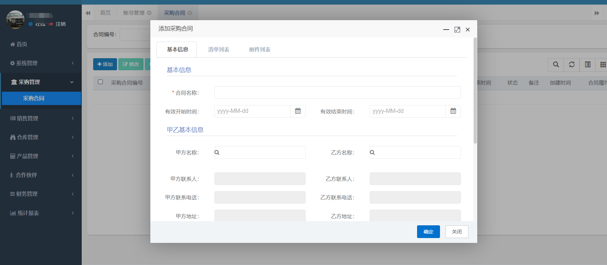
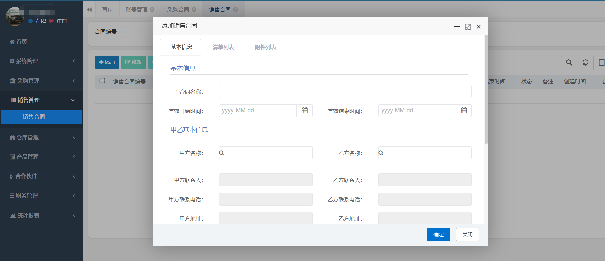
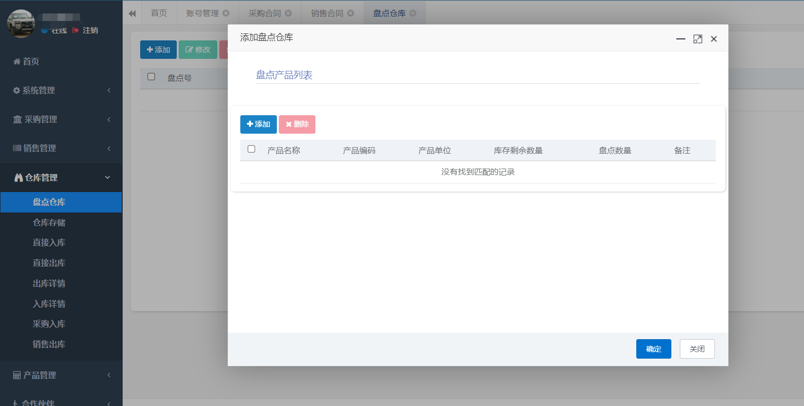
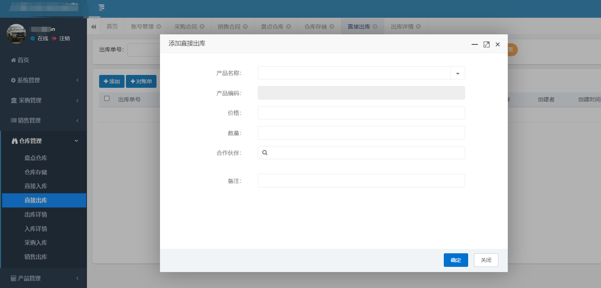
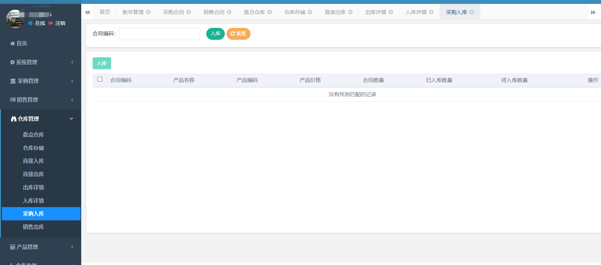
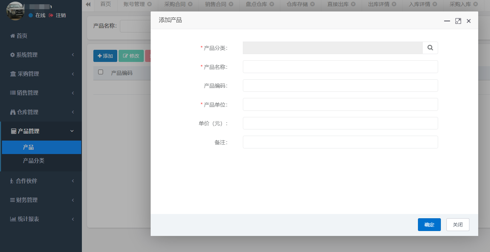
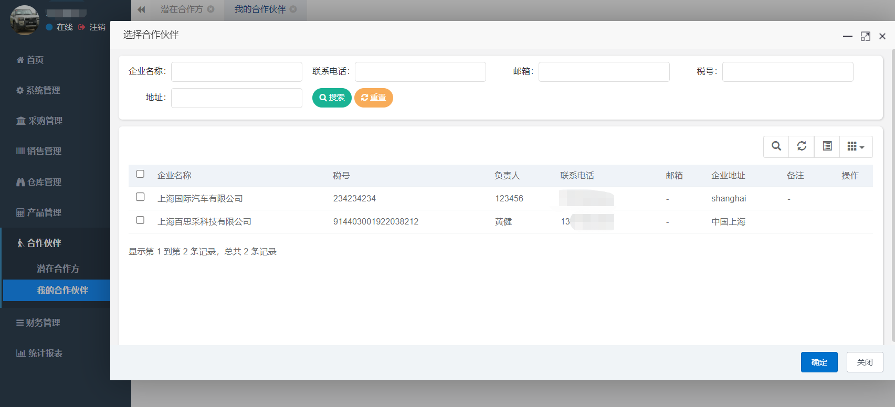
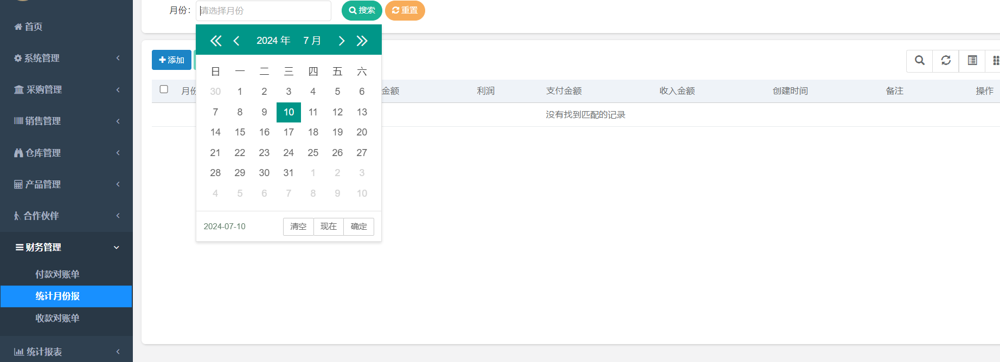

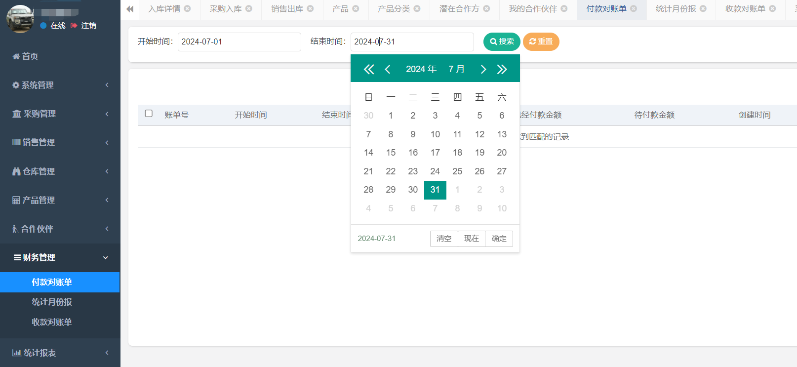

#### 使用软件

IDEAMySQL5.7
Navicat
JDK1.8
Maven3.6.1

#### 参与贡献

1. 程序员小孟
2. 恩林

#### 感谢支持

1.  感谢技术支持：www.javaclimb.com
